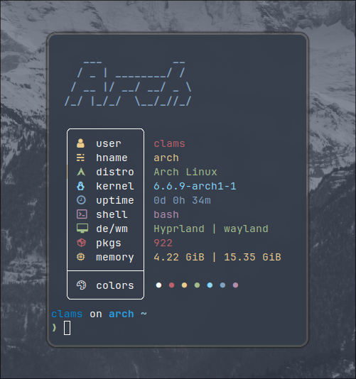

<div align="center">



</div>

<div align="center">

# fetch++

A rewrite of [`nitch`](https://github.com/ssleert/nitch) in C++ with some extra features.

</div>

### Why?

Because nitch has been unmaintained since 2022 and I think it was a neat project.

### Support

`fetch++` currently supports the following Linux distributions, although I have not been able to test all of them. If any problems arise, please make an [issue](https://github.com/clamsfeel2/fetchplusplus/issues).

- Ubuntu
- Arch
- EndeavourOS
- Artix
- Manjaro
- Debian
- Fedora
- RedHat
- Mint
- PopOS!
- Void
- OpenSUSE
- Gentoo
- NixOS
- Zorin
- Slackware
- CentOS

### Dependencies

> [!NOTE]
>
> *Having a [`NerdFont`](https://github.com/ryanoasis/nerd-fonts) installed on your system is required to make the icons display.*

`fetch++` relies on `g++`, `cmake`, and either `ninja` or `make` for compiling and building.

### Building and Installation

For those on Arch based systems, I have a [`PKGBUILD`](./install/PKGBUILD) available. 

For everyone else:

**Clone the repository and go into the new directory**

```sh
git clone https://github.com/clamsfeel2/fetchplusplus.git && cd fetchplusplus
```

**Create and cd into the build directory**

```sh
mkdir build && cd build
```

**Run CMake, then build the project**

```sh
cmake .. && make install
```

or with ninja

```sh
cmake -GNinja .. && ninja install
```

**To uninstall `fetch++` run**

```sh
make uninstall
```

or with ninja

```sh
ninja uninstall
```

### Usage

Just run

```sh
fetchpp
```

To **not** display ascii art

```sh
fetchpp --noascii
```

Adjust the box width in the output

```sh
fetchpp --width [integer >= 5]
```

Padding adjustment for each row/column is not currently supported, making this feature more of a gimmick for now. Still fun, I think.

### Configuration

In order to use the config file, put the [example config file](./config/EXAMPLE-config.toml) into the config directory. By default `fetch++` will use `$HOME/.config/fetchplusplus/config.toml` as the path to your config file. However, you are able to change the path by setting `FETCHPP_CONFIG_FILE` environment variable to a path ending in `config.toml` 

I think it is well documented, please let me know if not.
